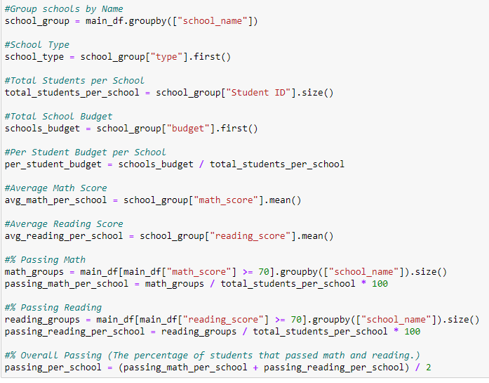
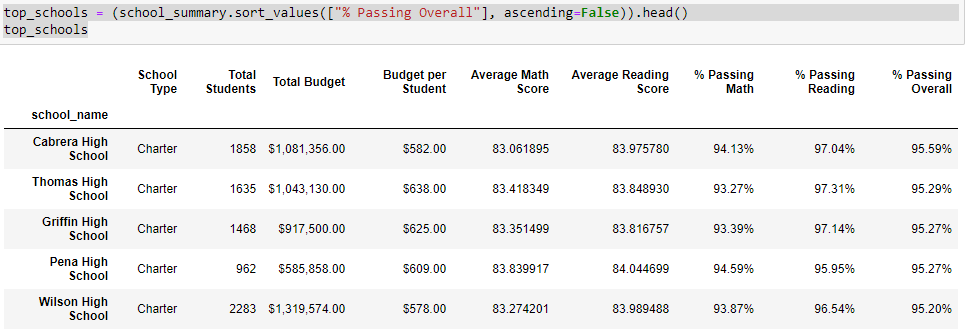

# PyCity-Schools

## Background

Well done! Having spent years analyzing financial records for big banks, you've finally scratched your idealistic itch and joined the education sector. In your latest role, you've become the Chief Data Scientist for your city's school district. In this capacity, you'll be helping the school board and mayor make strategic decisions regarding future school budgets and priorities.

As a first task, you've been asked to analyze the district-wide standardized test results. You'll be given access to every [student's math and reading scores](https://github.com/jaryan77/PyCity-Schools/blob/main/PyCitySchools/Resources/students_complete.csv), as well as various information on the [schools](https://github.com/jaryan77/PyCity-Schools/blob/main/PyCitySchools/Resources/schools_complete.csv) they attend. Your responsibility is to aggregate the data to and showcase obvious trends in school performance.

Your final report should include each of the following:

### District Summary
* Create a high level snapshot (in table form) of the district's key metrics, including:
    * Total Schools
    * Total Students
    * Total Budget
    * Average Math Score
    * Average Reading Score
    * % Passing Math (The percentage of students that passed math.)
    * % Passing Reading (The percentage of students that passed reading.)
    * % Overall Passing (The percentage of students that passed math and reading.)

Here is a screenshot of code to calculate the metrics listed above:

**NOTE**: `main_df` are the two CSVs merged on the column `school_name`. In order to get an accurate budget, I needed to use the data from [`school_data`](https://github.com/jaryan77/PyCity-Schools/blob/main/PyCitySchools/Resources/schools_complete.csv) only.

* To help make my report readable, I entered the metrics into a DataFrame and formatted the numbers accordingly:

### School Summary

* Create an overview table that summarizes key metrics about each school, including:
  * School Name
  * School Type
  * Total Students
  * Total School Budget
  * Per Student Budget
  * Average Math Score
  * Average Reading Score
  * % Passing Math (The percentage of students that passed math.)
  * % Passing Reading (The percentage of students that passed reading.)
  * % Overall Passing (The percentage of students that passed math **and** reading.)

Below is a screenshot of code to obtain the above results: 

* To help make my report readable, I entered the metrics into a DataFrame and formatted the numbers accordingly:

* Here is a screenshot of the results: 

## Top and Bottom Performing Schools

* Sort and display the top 5 and worst 5 performing schools: 

### Math Scores by Grade

* Create a table that lists the average Math Score for students of each grade level (9th, 10th, 11th, 12th) at each school.

### Reading Scores by Grade

* Create a table that lists the average Reading Score for students of each grade level (9th, 10th, 11th, 12th) at each school.

### Scores by School Spending

* Create a table that breaks down school performances based on average Spending Ranges (Per Student). Use 4 reasonable bins to group school spending. Include in the table each of the following:
  * Average Math Score
  * Average Reading Score
  * % Passing Math (The percentage of students that passed math.)
  * % Passing Reading (The percentage of students that passed reading.)
  * % Overall Passing (The percentage of students that passed math **and** reading.)

 

### Scores by School Size

* Repeat the above breakdown, but this time group schools based on a reasonable approximation of school size (Small, Medium, Large).

### Scores by School Type

* Repeat the above breakdown, but this time group schools based on school type (Charter vs. District).

